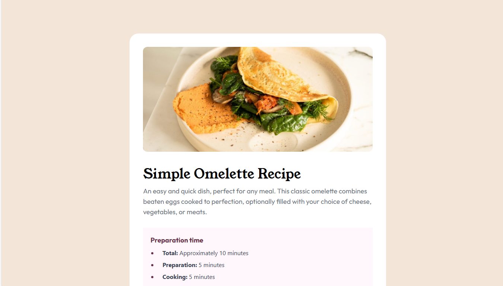

<div align="center">
    
    <h2><strong>Recipe Page</strong></h2>
    <a href="https://www.frontendmentor.io/challenges/recipe-page-KiTsR8QQKm"><strong>Frontend Mentor Challenge</strong></a>
    <br/>
    <br/>
    <a href="" target="_blank">View Demo</a>
    -
    <a href="https://github.com/MrMohammedMath/Recipe-page.git" target="_blank">Report Bug</a>
    -
    <a href="https://github.com/MrMohammedMath/Recipe-page.git" target="_blank">Request Feature</a>
    <br/>
    <!-- Profile -->
    <a href="https://www.frontendmentor.io/profile/MrMohammedMath">
        
    </a>
    <!-- Status -->
        
    <br/>
    <h3><strong>Built with</strong></h3>
    <a href="https://react.dev/" target="_blank">
        
    </a>
     <a href="https://tailwindcss.com/" target="_blank">
        
    </a>
</div>


### **Usage**

```bash
  git clone https://github.com/MrMohammedMath/Recipe-page.git

  cd Recipe-page

  npm install
```

- for running dev server

```bash
npm run dev
```

- for build & review

```bash
npm run build
npm run preview
```